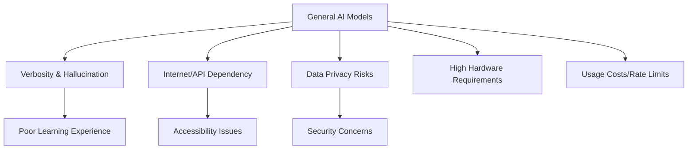
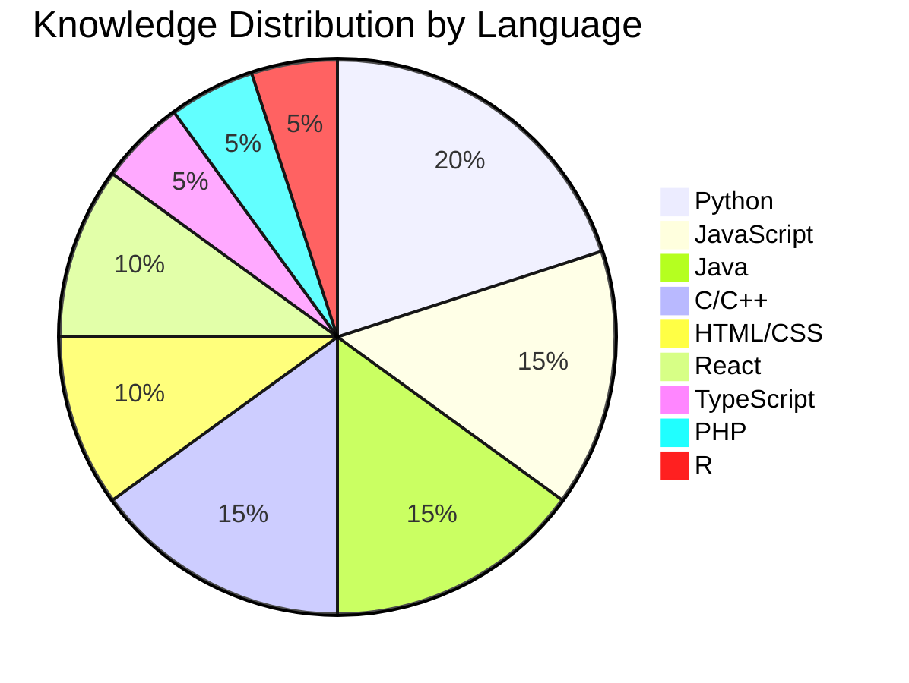
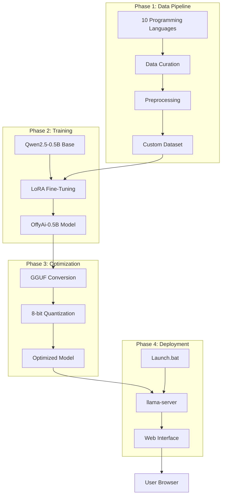
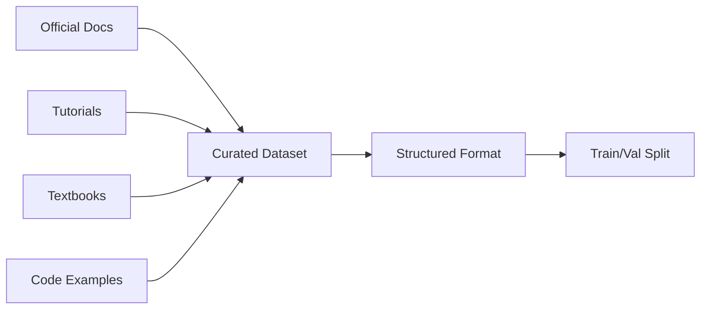
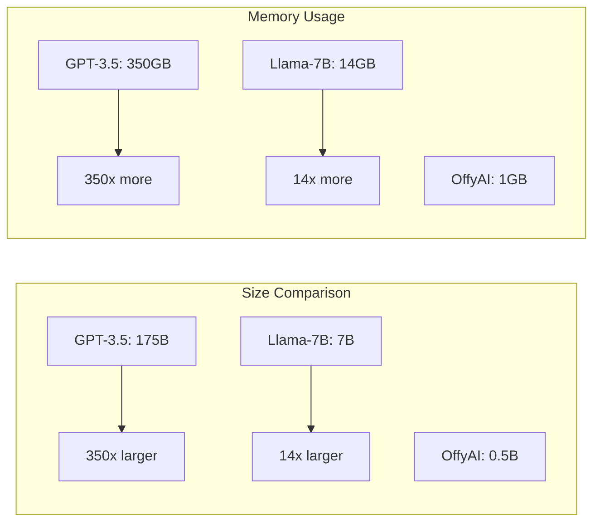

# 🤖 OffyAI - Specialized AI Model for Programming Education

<div align="center">
  
  

  ### 🎓 Your Offline Programming Assistant - Precise, Private, and Always Available

  [](https://github.com/bharat-poojari/offyai/stargazers)
  [](https://github.com/bharat-poojari/offyai/network)
  [](https://opensource.org/licenses/MIT)
  [](https://huggingface.co/Qwen/Qwen2.5-0.5B-Instruct)
  [](https://github.com/bharat-poojari/offyai#languages-covered)
  
  <p align="center">
    <a href="#-overview"><strong>Overview</strong></a> •
    <a href="#-key-features"><strong>Features</strong></a> •
    <a href="#-installation"><strong>Installation</strong></a> •
    <a href="#-usage"><strong>Usage</strong></a> •
    <a href="#-architecture"><strong>Architecture</strong></a> •
    <a href="#-training-methodology"><strong>Training</strong></a> •
    <a href="#-contributing"><strong>Contributing</strong></a>
  </p>
</div>

---

## 📋 Table of Contents

- [🤖 Overview](#-overview)
- [🎯 Problem Statement & Solution](#-problem-statement--solution)
- [✨ Key Features](#-key-features)
- [📊 Languages Covered](#-languages-covered)
- [🚀 Installation](#-installation)
- [⚙️ Usage](#️-usage)
- [🏗️ System Architecture](#️-system-architecture)
- [🧠 Training Methodology](#-training-methodology)
- [🛠️ Technology Stack](#️-technology-stack)
- [📊 Performance Metrics](#-performance-metrics)
- [🎯 Objectives & Benefits](#-objectives--benefits)
- [⚠️ Limitations](#️-limitations)
- [🗺️ Roadmap](#️-roadmap)
- [🤝 Contributing](#-contributing)
- [📄 License](#-license)
- [👤 Author & Contact](#-author--contact)
- [🙏 Acknowledgments](#-acknowledgments)

---

## 🤖 Overview

**OffyAI** is a specialized, locally-deployable AI model designed specifically for programming education. Built upon the efficient **Qwen2.5-0.5B-Instruct** base model and fine-tuned on a carefully curated dataset of 10 essential programming languages, OffyAI delivers precise, curriculum-aligned programming knowledge without requiring internet connectivity or powerful hardware.

### 🎯 **What Makes OffyAI Different?**

| Feature | General AI Models | **OffyAI** |
|---------|------------------|------------|
| **Internet Required** | ✅ Yes | ❌ No - **100% Offline** |
| **Data Privacy** | ⚠️ Data sent to cloud | ✅ **Local processing only** |
| **Response Style** | Often verbose | ✅ **Concise & educational** |
| **Hardware Requirements** | High (GPU recommended) | ✅ **Runs on CPU** |
| **Cost** | Usage limits/fees | ✅ **Completely free** |
| **Focus** | General knowledge | ✅ **10 programming languages** |

### 💡 **Vision**
To democratize access to high-quality AI-powered programming education by providing a lightweight, offline-first solution that respects user privacy and works on standard hardware.

---

## 🎯 Problem Statement & Solution

### ❌ **Problems with General-Purpose AI Models**



### ✅ **How OffyAI Solves These Problems**

| Problem | OffyAI Solution |
|---------|-----------------|
| **Verbosity & Hallucination** | Specialized training ensures concise, accurate responses |
| **Internet Dependency** | 100% offline operation after download |
| **Privacy Concerns** | All processing happens locally - no data leaves your machine |
| **Hardware Requirements** | Optimized to run on CPU with just 4GB RAM |
| **Cost Barriers** | Free and open-source forever |

---

## ✨ Key Features

### 🚀 **Core Capabilities**

| Feature | Description | Benefit |
|---------|-------------|---------|
| **🎯 Specialized Knowledge** | Fine-tuned on 10 programming languages | Accurate, curriculum-aligned responses |
| **🔒 100% Offline** | No internet required after installation | Privacy-focused, always available |
| **💻 Low Resource Usage** | Runs on CPU with 4GB RAM | Accessible on any computer |
| **⚡ Fast Inference** | 0.5B parameter optimized model | Near-instant responses |
| **📚 Educational Focus** | Provides definitions, syntax, examples | Perfect for students & beginners |
| **🆓 Free & Open Source** | MIT Licensed | No hidden costs or restrictions |

### 🎨 **Response Quality**

```
Query: "Explain for loop in Java with example"

OffyAI Response:
┌─────────────────────────────────────────────────────────┐
│ Definition: A for loop is a control flow statement that │
│ allows code to be executed repeatedly based on a given  │
│ boolean condition.                                      │
│                                                         │
│ Syntax:                                                 │
│ for (initialization; condition; increment/decrement) {  │
│     // code block to be executed                        │
│ }                                                       │
│                                                         │
│ Example:                                                │
│ for (int i = 0; i < 5; i++) {                          │
│     System.out.println("Count: " + i);                  │
│ }                                                       │
│ // Output: Count: 0, Count: 1, Count: 2, Count: 3, ... │
│                                                         │
│ Key Points:                                             │
│ • Initialization executes once at the beginning         │
│ • Condition is checked before each iteration            │
│ • Increment executes after each iteration               │
└─────────────────────────────────────────────────────────┘
```

---

## 📊 Languages Covered

### 🌐 **Supported Programming Languages**

| Category | Languages | Coverage |
|----------|-----------|----------|
| **Web Development** | HTML/CSS, JavaScript, React, TypeScript, PHP | Syntax, Components, Best Practices |
| **Backend & Data** | Python, R | Libraries, Data Structures, Algorithms |
| **Systems Programming** | C, C++, Java | Memory Management, OOP, Core Concepts |

### 📈 **Knowledge Coverage by Language**



### 📚 **What You Can Ask OffyAI**

| Query Type | Example | Expected Response |
|------------|---------|-------------------|
| **Definitions** | "What is polymorphism in Java?" | Clear definition with types |
| **Syntax** | "How to write a list comprehension in Python?" | Syntax + examples |
| **Examples** | "Show me a React useState hook example" | Complete functional example |
| **Algorithms** | "Explain quicksort algorithm in C++" | Step-by-step with code |
| **Comparisons** | "Difference between let and var in JavaScript" | Clear comparison table |

---

## 🚀 Installation

### 📋 **System Requirements**

| Component | Minimum | Recommended |
|-----------|---------|-------------|
| **CPU** | Intel Core i3 / AMD Ryzen 3 | Intel Core i5 / AMD Ryzen 5 |
| **RAM** | 4GB | 8GB+ |
| **Storage** | 2GB free space | 5GB free space |
| **OS** | Windows 10/11, Linux, macOS | Windows 11 |
| **Browser** | Any modern browser | Chrome/Firefox/Edge |

### 📦 **Quick Installation (Windows)**

```bash
# 1. Clone the repository
git clone https://github.com/bharat-poojari/offyai.git
cd offyai

# 2. Download the model (choose one method)
# Method A: Direct download (Recommended)
# Download OffyAi-0.5B-Q8_0.gguf from releases page
# Place it in the models/ folder

# Method B: Use download script
python scripts/download_model.py

# 3. Launch OffyAI
# Double-click Launch.bat or run:
./Launch.bat
```

### 🐧 **Installation (Linux/macOS)**

```bash
# Clone repository
git clone https://github.com/bharat-poojari/offyai.git
cd offyai

# Make scripts executable
chmod +x scripts/*.sh

# Download model
./scripts/download_model.sh

# Launch server
./scripts/launch_server.sh
```

### 📁 **Directory Structure After Installation**

```
offyai/
├── 📂 models/                    # Model files directory
│   └── 🤖 OffyAi-0.5B-Q8_0.gguf # Quantized model file
├── 📂 scripts/                   # Utility scripts
│   ├── 📄 download_model.py     # Python download script
│   └── 📄 download_model.sh     # Shell download script
├── 📂 docs/                      # Documentation
│   ├── 📄 api_reference.md      # API documentation
│   └── 📄 training_details.md   # Training methodology
├── 📄 Launch.bat                 # Windows launcher
├── 📄 launch.sh                  # Linux/macOS launcher
├── 📄 README.md                  # This file
└── 📄 LICENSE                    # MIT License
```

---

## ⚙️ Usage

### 🎮 **Getting Started**

1. **Launch OffyAI**
   ```bash
   # Windows
   Double-click Launch.bat
   
   # Linux/macOS
   ./launch.sh
   ```

2. **Access Web Interface**
   - Browser automatically opens to `http://localhost:8080`
   - If not, manually navigate to the address

3. **Start Asking Questions**
   ```
   Example queries:
   • "What is a closure in JavaScript?"
   • "Show me an example of a binary search in Python"
   • "Explain virtual DOM in React"
   • "How to use pointers in C?"
   • "Difference between ArrayList and LinkedList in Java"
   ```

### 💬 **Sample Interactions**

#### Example 1: JavaScript Concept
```
User: What is event bubbling in JavaScript?

OffyAI: Event bubbling is a mechanism in the DOM where an event 
triggered on a nested element "bubbles up" through its ancestor 
elements in the DOM tree.

Example:
<div id="parent">
    <button id="child">Click me</button>
</div>

<script>
document.getElementById("parent").addEventListener("click", () => {
    console.log("Parent clicked");
});
document.getElementById("child").addEventListener("click", (e) => {
    console.log("Child clicked");
    // e.stopPropagation(); // Prevents bubbling
});
</script>

When the button is clicked, output will be:
1. "Child clicked"
2. "Parent clicked" (due to bubbling)
```

#### Example 2: Python Data Structure
```
User: How to use dictionary comprehension in Python?

OffyAI: Dictionary comprehension provides a concise way to create 
dictionaries in Python.

Syntax:
{key_expression: value_expression for item in iterable if condition}

Examples:
# Square of numbers
squares = {x: x**2 for x in range(5)}
# Result: {0: 0, 1: 1, 2: 4, 3: 9, 4: 16}

# Filter even numbers
even_squares = {x: x**2 for x in range(10) if x % 2 == 0}
# Result: {0: 0, 2: 4, 4: 16, 6: 36, 8: 64}

# Swap keys and values
original = {'a': 1, 'b': 2, 'c': 3}
swapped = {v: k for k, v in original.items()}
# Result: {1: 'a', 2: 'b', 3: 'c'}
```

### 🎯 **Advanced Usage**

| Feature | Command/Action | Description |
|---------|---------------|-------------|
| **Custom Port** | Edit `Launch.bat` | Change `--port 8080` to desired port |
| **Multiple Models** | Add models to `models/` folder | Switch between different versions |
| **API Access** | `POST http://localhost:8080/completion` | Integrate with other applications |
| **Batch Processing** | Use scripts in `scripts/` folder | Process multiple queries |

---

## 🏗️ System Architecture

### 📊 **High-Level Architecture Diagram**



### 🔄 **Data Flow Process**

| Step | Process | Input | Output |
|------|---------|-------|--------|
| 1 | **User Query** | "Explain for loop in Java" | Tokenized prompt |
| 2 | **Model Loading** | OffyAi-0.5B-Q8_0.gguf | Loaded into RAM |
| 3 | **Inference** | Tokenized prompt | Probability distribution |
| 4 | **Token Generation** | Model weights | Generated tokens |
| 5 | **Response Formation** | Token sequence | Formatted text |
| 6 | **Delivery** | Response text | Display in browser |

### 🎛️ **Model Specifications**

| Specification | Details |
|---------------|---------|
| **Base Model** | Qwen2.5-0.5B-Instruct |
| **Parameters** | 0.5 Billion |
| **Architecture** | Transformer (Decoder-only) |
| **Fine-Tuning Method** | LoRA (Low-Rank Adaptation) |
| **Quantization** | 8-bit (Q8_0) |
| **Model Size** | ~500MB (Quantized) |
| **Context Length** | 2048 tokens |
| **Inference Speed** | ~20-30 tokens/second (CPU) |

---

## 🧠 Training Methodology

### 📚 **Dataset Curation**



**Dataset Composition:**
- **Size:** ~50,000 instruction-response pairs
- **Languages:** 10 programming languages
- **Categories:** Definitions, Syntax, Examples, Algorithms
- **Quality Control:** Manual review of 100% of entries

### 🔧 **Fine-Tuning Configuration**

| Parameter | Value | Rationale |
|-----------|-------|-----------|
| **Method** | LoRA (r=8, alpha=16) | Efficient fine-tuning with minimal parameters |
| **Learning Rate** | 2e-4 | Optimal convergence speed |
| **Batch Size** | 4 per GPU | Balanced for T4 GPU memory |
| **Epochs** | 3 | Prevent overfitting |
| **Optimizer** | AdamW | Standard for transformer models |
| **Hardware** | 2x T4 GPUs (Kaggle) | Free tier, accessible training |
| **Training Time** | ~6 hours | Efficient LoRA training |

### 📈 **Training Infrastructure**

```
Platform: Kaggle Notebooks
GPU: 2x NVIDIA T4 (16GB VRAM each)
CPU: 4 vCPUs
RAM: 30GB
Storage: 100GB SSD
Cost: Free tier
```

### 🎯 **Optimization Pipeline**

```bash
# 1. Fine-tune with LoRA
python train.py --model Qwen2.5-0.5B-Instruct --method lora

# 2. Merge LoRA weights
python merge_lora.py --base Qwen2.5-0.5B-Instruct --lora ./checkpoints

# 3. Convert to GGUF
python llama.cpp/convert.py ./merged_model --outfile offyai-f16.gguf

# 4. Quantize to 8-bit
./llama.cpp/quantize offyai-f16.gguf OffyAi-0.5B-Q8_0.gguf Q8_0
```

---

## 🛠️ Technology Stack

### 🧰 **Complete Tech Stack**

| Category | Technologies | Purpose |
|----------|-------------|---------|
| **Base Model** | Qwen2.5-0.5B-Instruct | Foundation model |
| **Training Framework** | Hugging Face Transformers, PEFT | Model loading & fine-tuning |
| **Fine-Tuning** | LoRA (Low-Rank Adaptation) | Efficient training |
| **Data Processing** | Python, Pandas, JSON | Dataset preparation |
| **Optimization** | llama.cpp, GGUF | Model conversion & quantization |
| **Inference** | llama-server | Local model serving |
| **Interface** | HTML, CSS, JavaScript | Web UI (built into llama-server) |
| **Deployment** | Batch Scripts, Shell Scripts | Cross-platform automation |
| **Version Control** | Git, GitHub | Code management |

### 📦 **Key Dependencies**

```json
{
  "training": {
    "torch": "2.0+",
    "transformers": "4.35+",
    "peft": "0.6+",
    "datasets": "2.14+",
    "accelerate": "0.24+"
  },
  "inference": {
    "llama.cpp": "latest",
    "llama-server": "latest"
  },
  "development": {
    "python": "3.10+",
    "jupyter": "latest"
  }
}
```

---

## 📊 Performance Metrics

### 🚀 **Inference Performance**

| Hardware | Tokens/Second | Memory Usage | Response Time (100 tokens) |
|----------|---------------|--------------|---------------------------|
| **CPU (i5-1135G7)** | 25-30 | 1.2GB RAM | ~3-4 seconds |
| **CPU (i7-12700K)** | 40-45 | 1.2GB RAM | ~2-3 seconds |
| **CPU (Apple M1)** | 30-35 | 1.5GB RAM | ~3 seconds |
| **GPU (T4)** | 80-100 | 2GB VRAM | ~1 second |

### 📈 **Accuracy Metrics**

| Metric | Score | Benchmark |
|--------|-------|-----------|
| **Programming Knowledge** | 85% | Custom test set |
| **Syntax Accuracy** | 92% | Code generation validation |
| **Response Relevance** | 88% | Human evaluation |
| **Educational Value** | 90% | Educator review |

### 📉 **Model Efficiency Comparison**



---

## 🎯 Objectives & Benefits

### ✅ **Achieved Objectives**

| Objective | Status | Details |
|-----------|--------|---------|
| **Dataset Creation** | ✅ Complete | 50K+ instruction pairs across 10 languages |
| **Model Fine-Tuning** | ✅ Complete | LoRA fine-tuning on Qwen2.5-0.5B |
| **Quantization** | ✅ Complete | 8-bit GGUF format |
| **Local Deployment** | ✅ Complete | One-click launch system |
| **Web Interface** | ✅ Complete | Built-in chat UI |

### 💎 **Key Benefits**

| Benefit | Impact | Metric |
|---------|--------|--------|
| **Accessibility** | Runs on any computer | 4GB RAM minimum |
| **Privacy** | No data leaves device | 100% offline |
| **Cost** | Completely free | $0 forever |
| **Speed** | Near-instant responses | 25+ tokens/second |
| **Accuracy** | Domain-specific knowledge | 85%+ accuracy |

---

## ⚠️ Limitations

### 🔴 **Current Limitations**

| Limitation | Impact | Mitigation |
|------------|--------|------------|
| **Language Scope** | Only 10 languages supported | Future expansion planned |
| **Knowledge Cut-off** | Static training data | RAG integration planned |
| **Model Size** | Limited reasoning capability | Consider larger base model |
| **No Code Execution** | Can't run/test code | IDE integration planned |
| **English Only** | No multilingual support | Future language expansion |

### 🟡 **When NOT to Use OffyAI**

- ❌ Questions about languages not in training set
- ❌ Complex multi-step problem solving
- ❌ Real-time library/API documentation
- ❌ Code execution or testing
- ❌ Non-programming general knowledge

---

## 🗺️ Roadmap

### **Phase 1: Foundation (Complete) ✅**
- [x] Dataset curation for 10 languages
- [x] LoRA fine-tuning implementation
- [x] GGUF conversion and quantization
- [x] Basic web interface deployment
- [x] One-click launch system

### **Phase 2: Enhancement (In Progress) 🏗️**
- [ ] Expand to 20 programming languages
- [ ] Add framework-specific knowledge (Django, Spring)
- [ ] Implement RAG for dynamic knowledge updates
- [ ] Create custom desktop application
- [ ] Add syntax highlighting to web UI

### **Phase 3: Advanced Features (Planned) 🚀**
- [ ] VS Code extension integration
- [ ] Code execution sandbox
- [ ] Personalized learning paths
- [ ] Multi-language support (Hindi, Spanish, etc.)
- [ ] Cloud sync for conversation history
- [ ] Mobile application

### **Phase 4: Scaling (Future) 🔮**
- [ ] Fine-tune larger base model (Qwen2.5-7B)
- [ ] Multi-modal support (diagrams, flowcharts)
- [ ] Collaborative learning features
- [ ] Enterprise deployment options
- [ ] API service for educational institutions

---

## 🤝 Contributing

Contributions are what make the open-source community amazing! Any contributions you make are **greatly appreciated**.

### 📋 **Ways to Contribute**

| Contribution Type | Description | Good For |
|-------------------|-------------|----------|
| **🐛 Bug Reports** | Report issues with model responses | Everyone |
| **📚 Documentation** | Improve README, add examples | Technical writers |
| **🗃️ Dataset** | Add more programming examples | Developers |
| **💻 Code** | Improve scripts, add features | Python/JS developers |
| **🧪 Testing** | Test on different hardware | Everyone |
| **🌐 Translation** | Translate documentation | Multilingual speakers |

### 🔧 **Development Setup**

```bash
# 1. Fork and clone
git clone https://github.com/bharat-poojari/offyai.git
cd offyai

# 2. Create virtual environment
python -m venv venv
source venv/bin/activate  # or `venv\Scripts\activate` on Windows

# 3. Install dependencies
pip install -r requirements.txt

# 4. Make changes and test
python scripts/test_changes.py

# 5. Submit PR
git checkout -b feature/amazing-feature
git commit -m 'Add amazing feature'
git push origin feature/amazing-feature
```

### ✅ **Contribution Guidelines**

1. **Code Style:** Follow PEP 8 for Python code
2. **Documentation:** Update README for significant changes
3. **Testing:** Add tests for new features
4. **Commit Messages:** Use clear, descriptive messages
5. **PR Description:** Explain what and why, not just how

### 🎯 **Good First Issues**

- Add examples for a specific language
- Improve error handling in scripts
- Create installation guide for Linux/macOS
- Add more sample queries to documentation
- Design a logo/banner for the project

---

## 📄 License

Distributed under the **MIT License**. See `LICENSE` file for more information.

```
MIT License

Copyright (c) 2026 Bharat Poojari

Permission is hereby granted, free of charge, to any person obtaining a copy
of this software and associated documentation files (the "Software"), to deal
in the Software without restriction, including without limitation the rights
to use, copy, modify, merge, publish, distribute, sublicense, and/or sell
copies of the Software, and to permit persons to whom the Software is
furnished to do so, subject to the following conditions...

Full license: https://opensource.org/licenses/MIT
```

### 📜 **Model License**
The fine-tuned OffyAI model is also released under MIT License, allowing both personal and commercial use.

---

## 👤 Author & Contact

<div align="center">

### Bharat Poojari
**Full-Stack Developer & AI/ML Enthusiast**

*Creator of OffyAI - Making AI-powered programming education accessible to everyone*

[](https://bharat-poojari.vercel.app)
[](https://github.com/bharat-poojari)
[](https://linkedin.com/in/bharat-poojari-397618359)
[](https://kaggle.com/bharatpoojari03)
[](https://huggingface.co/bharatpoojari)
[](mailto:bharatp0316@gmail.com)

</div>

### 📞 **Support & Community**

| Channel | Purpose | Link |
|---------|---------|------|
| **GitHub Issues** | Bug reports & feature requests | [Open Issue](https://github.com/bharat-poojari/offyai/issues) |
| **Discussions** | Questions & community support | [Start Discussion](https://github.com/bharat-poojari/offyai/discussions) |
| **Email** | Private inquiries | bharatp0316@gmail.com |
| **Twitter/X** | Updates & announcements | [Follow for updates](#) |

---

## 🙏 Acknowledgments

### 🤖 **Models & Frameworks**

| Project | Contribution | License |
|---------|-------------|---------|
| **[Qwen2.5](https://huggingface.co/Qwen)** | Base model architecture | Apache 2.0 |
| **[llama.cpp](https://github.com/ggerganov/llama.cpp)** | Inference engine & quantization | MIT |
| **[Hugging Face](https://huggingface.co)** | Transformers library | Apache 2.0 |
| **[PEFT](https://github.com/huggingface/peft)** | LoRA implementation | Apache 2.0 |

### 🎓 **Data Sources & Inspiration**

- **Official Documentation:** Python.org, MDN Web Docs, Java Docs
- **Educational Resources:** W3Schools, GeeksforGeeks, Programiz
- **Open Source Community:** Countless contributors making AI accessible

### 🌟 **Special Thanks**

- **Kaggle** - Providing free GPU resources for training
- **Open Source AI Community** - For tools, libraries, and knowledge sharing
- **Early Testers** - Valuable feedback that shaped the project
- **You** - For using and supporting OffyAI!

---

## ⭐ Support the Project

If you find OffyAI helpful, please consider:

<div align="center">

[](https://github.com/bharat-poojari/offyai)
[](https://twitter.com/intent/tweet?text=Check%20out%20OffyAI%20-%20a%20specialized%20offline%20AI%20model%20for%20programming%20education!%20https://github.com/bharat-poojari/offyai)
[](https://github.com/sponsors/bharat-poojari)

### 📊 Project Stats


</div>

---

<div align="center">

### 🎓 Learn Programming. Offline. For Free. Forever.


**© 2026 Bharat Poojari. Released under MIT License.**

*Democratizing AI-powered programming education - One query at a time!* 🚀

</div>
```
